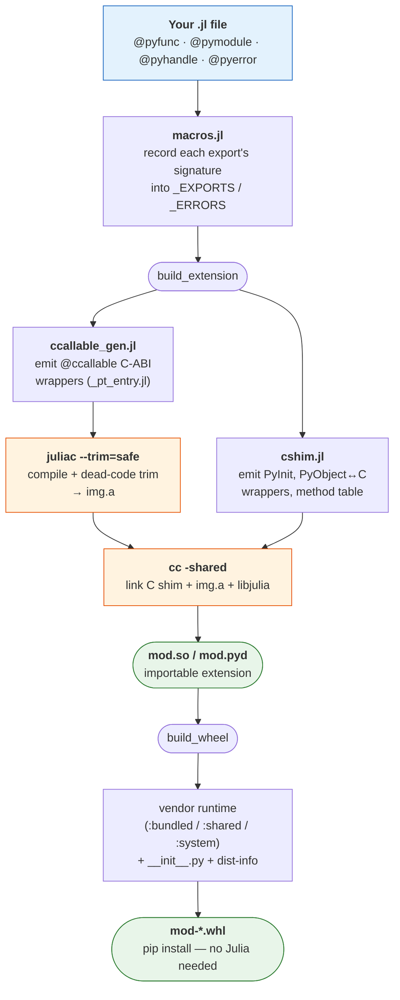

# Building

ParselTongue offers two build entry points. Both run the same pipeline: your
annotated Julia is turned into a trimmed native object, a CPython C shim is
generated from the very same macro metadata, and the two are linked into an
importable extension. `build_wheel` adds packaging on top.

## The build pipeline



The key idea: the `@ccallable` Julia wrappers and the C shim are generated from
**one** source of truth — ParselTongue's own macro metadata — so every argument
type, return type, and struct layout is already known. There is no separate ABI
description to keep in sync, and no hand-written C. `build_extension` stops at the
`.so`; `build_wheel` continues through packaging.

## `build_wheel` — a self-contained, pip-installable wheel

```julia
build_wheel("mymod.jl"; version = "0.2.0", outdir = "dist")
```

Produces `dist/mymod-0.2.0-<pytag>.whl` that bundles the Julia runtime. Install it
with `pip` on any compatible machine — **no Julia required**. This is what you
ship.

The wheel layout:

```
mymod/__init__.py                     re-exports the compiled extension
mymod/_mymod.<EXT_SUFFIX>             the extension (PyInit__mymod)
mymod/julia/lib/libjulia.so.1.x       Julia runtime, original relative layout
mymod/julia/lib/julia/…               preserved so the libs resolve each other
mymod-<ver>.dist-info/{METADATA,WHEEL,RECORD}
```

## `build_extension` — just the extension `.so`

```julia
build_extension("mymod.jl"; outdir = "build")
```

Produces only `build/mymod.<EXT_SUFFIX>` and does **not** bundle libjulia — the
surrounding environment must provide it (its rpath points at the Julia that built
it). Useful for local iteration and testing.

## Options

Both functions accept:

| Keyword | Default | Meaning |
|---------|---------|---------|
| `mod_name` | from `@pymodule`, else the file's base name | Python module name |
| `outdir` | next to the source file | output directory |
| `trim` | `:safe` | `:safe` errors on dynamic dispatch; `:unsafe` / `:unsafe_warn` relax it |
| `python` | `"python3"` | the Python interpreter to target |
| `verbose` | `false` | print the juliac and link commands |

`build_wheel` additionally takes `version` (default `"0.1.0"`), `runtime`
(`:bundled` / `:shared` / `:system`), `slim`, `manylinux`, `abi3`, and
`emit_pyproject`.

### `emit_pyproject` — a publishable project layout

Pass `emit_pyproject=true` to write a minimal PEP 621 `pyproject.toml` next to
the wheel, turning the output directory into a project layout ready for
`twine upload` / PyPI:

```julia
build_wheel("mymod.jl"; version="1.0.0", outdir="dist", emit_pyproject=true)
# dist/mymod-1.0.0-…-linux_x86_64.whl
# dist/pyproject.toml   ← name, version, requires-python, numpy extra
```

`requires-python` is `>=3.11` for `abi3=true` wheels (which run on any CPython ≥
3.11), otherwise the build interpreter's version. A `runtime=:shared` build adds
the `parseltongue-runtime` dependency. The wheel itself is still produced by
juliac — the `pyproject.toml` documents project metadata for publishing tools.
On the CLI: `pt wheel mymod.jl --emit-pyproject`.

### Multi-module wheels

To ship several modules that import together in one Python process, aggregate
their source files into a single extension with
[`build_multi_wheel`](/reference/api#Building):

```julia
# geo.jl:  @pymodule geo begin … end
# num.jl:  @pymodule num begin … end
build_multi_wheel(["geo.jl", "num.jl"], "mathpkg"; outdir="dist")
# python -c "import mathpkg; mathpkg.geo.area(3,4); mathpkg.num.gcd_(12,18)"
```

Each file's bare `@pymodule <name>` becomes a submodule `mathpkg.<name>`. They
share **one** Julia runtime image (one `jl_init`), which is required — two
separately compiled extensions cannot coexist in a process (see
[Limitations](/guide/limitations#One-extension-per-Python-process)). Function
names must be unique across the files (they share one C method table). All the
`runtime`, `slim`, `abi3`, and `emit_pyproject` options work as in `build_wheel`.

### Trim modes

`--trim=safe` (the default) makes juliac **error at build time** if an exported
code path needs dynamic dispatch. ParselTongue translates the raw verifier output
into a source-mapped `TrimFailure` that points directly to the problem:

```julia
# bad.jl
@pymodule bad begin
    @pyfunc dyn(n::Int64)::Int64 = Base.inferencebarrier(n) + 1
end
```

```julia
julia> build_extension("bad.jl")
ERROR: TrimFailure: juliac --trim=safe rejected 1 call site (4 verifier errors) — these calls are not statically resolvable.

  ✗ dyn(n::Int64)  bad.jl:3  (4 errors)
      unresolved: (Base.compilerbarrier(:type, n::Int64)::Any + 1)::Any
      → a value inferred as `Any` makes this call dynamic — annotate or narrow the type
        (e.g. `x::Concrete`, a type assertion, or avoid abstract containers) so the
        call is statically resolvable.

  (rebuild with verbose=true / keep_build=true for raw juliac output.)
```

The fix is to make the offending function type-stable — remove `inferencebarrier`,
use concrete types, or add a type assertion. As an escape hatch:

```julia
build_wheel("mymod.jl"; trim = :unsafe_warn)   # warns instead of erroring
```

See the [API Reference](/reference/api#Building) for the full docstrings of
[`build_extension`](@ref) and [`build_wheel`](@ref).
